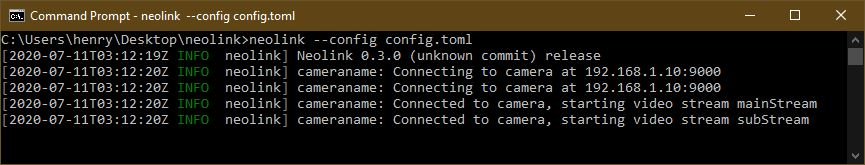
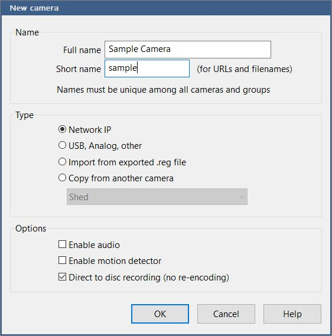
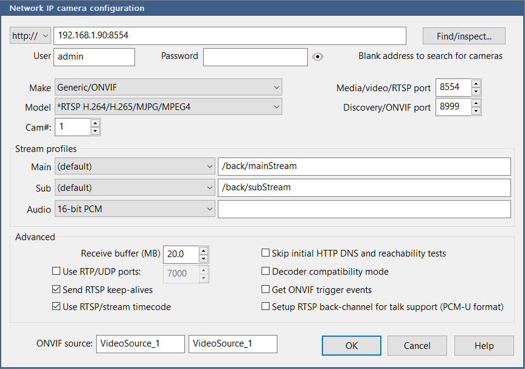
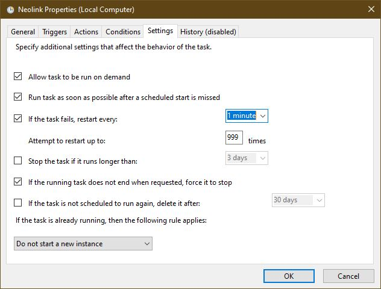

# Setting Up Neolink For Use With Blue Iris

Stock Reolink cameras do not support use with non-proprietary surveillance software such as Blue Iris. Neolink enables you to use your unsupported cameras with Blue Iris and other viewers/recorders. In this guide, you will learn how to configure your Reolink cameras and Neolink for use with Blue Iris software.

**This guide applies to the following camera models:**
- B800/D800
- B400/D400
- E1

## Step One: Configuring Your Cameras
The first thing to do to make video recording run smoothly is tweak the settings on your cameras to work around known Neolink problems, and to set them up as a part of your network.

### 1. Update your Camera's firmware.
_The cameras have software bugs too, and Reolink is constantly working to fix them. Cameras ship with older versions which have **known bugs.** It's best to eliminate any unknown parameters when setting up your cameras._
1. Download the latest version of firmware for your camera at [Reolink's official firmware update site](https://support.reolink.com/hc/en-us/sections/360002374874-Firmware)
2. Unzip the firmware package.
3. Refer to [Reolink's official firmware upgrade guide](https://support.reolink.com/hc/en-us/articles/360004084333-Upgrade-Firmware-via-Reolink-Client-Windows-) for more information on how to upgrade firmware.

### 2. Assign a static IP address to your cameras
_This is the most reliable setup since Neolink cannot autodetect when a camera's IP address changes._
1. In the Reolink PC app, login to your camera.

2. Click "Device Settings" (the gear) -> "Network General."

3. Change "Connection Type" from "DHCP" to "Static."

4. Enter a static IP address compatible with your network (i.e. `192.168.1.15`).

   Note: Here is a [good article](https://www.lifewire.com/using-static-ip-address-on-private-computer-818404#:~:text=Static%20IP%20Address%20Assignment%20on%20Home%20Networks.%201,addresses%20in%20the%2010.x.x.x%20private%20range%20...%20) about how to select an IP address that is compatible with your network. If you accidentally lose access to your camera by setting an incompatible IP address, you will have to manually reset the camera with its physical reset button.

_You will have to reconnect to the camera once you have changed the IP address_

### 3. Set a Password
_It's recommended that you set a password for each of your cameras. If you want to use the Reolink Mobile App, it makes you set a password for each camera anyway._
1. In the Reolink PC app, login to your camera.
2. Click "Device Settings" -> "Manage User."
3. Click "Modify Password."

**Now you've set up your cameras!**

## Step Two: Setting Up Neolink
### 1. Installation
Refer to [Neolink's README](https://github.com/thirtythreeforty/neolink/blob/master/README.md) for instructions on installing.
### 2. Create your config file.
The config file tells Neolink how to connect to your camera and serve the video streams.
1. Create a simple text file (i.g. `config.toml`) in the same directory you have unpacked Neolink with the following format:

        bind = "0.0.0.0"
        
        [[cameras]]
        name = "cameraname"
        username = "admin"
        password = "password"
        address = "192.168.1.10:9000"
        stream = "both"
    
2. Change `cameraname` to a legible, phonetic name that describes your camera. Leave the quotes around the name.

3. The default username is `admin`; leave this unless you've created another user.

4. Replace `password` with the password you set on the camera. If you chose to not use a password, remove this line from the config file. Again, leave the quotes.

5. Replace `192.168.1.10:9000` with the IP address you set for your camera. 
    Note: The port, `:9000`, should remain at the end of your IP address. This is the proprietary "media port" that Reolink uses.
    
6. The `stream` line allows you to choose which stream type to use. Neolink supports streaming two streams, the main-stream, and the sub-stream. It can stream either one, or both. If you wish to stream both streams, leave this line as is. If you wish to stream _only_ the main-stream, change `both` to `mainStream`. If you wish to stream only the sub-stream, change `both` to `subStream`.

    Note: Reolink D400/B400 Cameras **_do not support serving both streams at once_**, so you must manually choose which stream type to use. For best quality, choose the main stream.

7. For multiple cameras, copy and paste the entire `[[cameras]]` block below the first. Each camera entry must begin with `[[cameras]]`.

Note: For **E1 Cameras**, refer to [the readme](https://github.com/thirtythreeforty/neolink/#configuration) for instructions on adding the `format =` line. This configuration will be done automatically in the future.

### 3. Start Neolink
1. Open a command prompt in the directory that contains Neolink and your config file.
2. Run the following command (with your correct config file name):

        neolink --config config.toml

You should get login messages that look something like this:

Note: Neolink hosts all streams on localhost port 8554. Each camera has a designated path for the sub-stream and the main-stream. Neolink gets the name of the path from the name of the camera you set in the config file. So the path to the sample camera's main-stream would be `127.0.0.1:8554/cameraname/mainStream` and the path to the sample camera's sub-stream would be `127.0.0.1:8554/cameraname/subStream`.

**Now you have Neolink up and running!**

## Step Three: Setting up Blue Iris
_There are a few tricks to getting Blue Iris to work properly with Neolink's RTSP streams._

### 1. Add a new Camera
1. Click "Main Menu" -> "add new camera."

2. Give your camera a full name and a short name.
3. Uncheck "Enable Motion Detector."
4. Enable "Direct to disc recording."

5. Click "OK."

### 2. Configure the Camera

_Once you click "OK" on the "New Camera" window, Blue Iris should dump you directly into the camera configuration._

1. Leave protocol set to "http://."

   _Although we are using RTSP streams, Blue Iris does not allow the use of sub-streams if you set the protocol to RTSP._

2. In the address bar, enter `127.0.0.1:8554`. This will be the same for all cameras.
3. Clear the password field.
4. Set the "Main stream" path to `/cameraname/mainStream`, changing `cameraname` to the name of the camera you set in Neolink's config file.
5. Set the "Sub stream" path to `/cameraname/subStream`, also changing `cameraname` to the name of your camera.

6. Under "Network Options," set "Receive Buffer" to 20MB.

   _This is because the 4k cameras' key frames are so large._

7. Click "OK."

**Congrats, you have set up your first camera!**

## Step Four: Run Everything at Startup

_In the future, Neolink will support being a Windows Service. For now, you must manually set up Neolink to run at startup._

### 1. Enable Blue Iris as a Windows service

_Blue Iris natively supports running as a Windows service._

1. In Blue Iris, click the "Main Menu" button, then click "Settings/Info."
2. In the "Startup" tab, under "Operating System," check "Run as a Windows Service (no UI, run again for console)."
3. Type in the username and password.
4. Once you click OK, you should see a popup window that says "Service has been installed..."

5. Restart Blue Iris or your computer to start the Blue Iris service.

### 2. Create a Scheduled Task that starts Neolink

_The best way to have Neolink run at startup is create a Scheduled Task that starts the Neolink process at computer startup._

1. Create a simple bash file that starts Neolink.

   _For the Task Scheduler to successfully start Neolink, you must run the start commands in the same directory that contains Neolink and its config files. This is best accomplished by creating a bash file that "changes directories" to the directory that contains Neolink._
   1. Navigate in Windows Explorer to the directory in which you placed Neolink and its config files.

   2. Create a file with a `.cmd` file extension (e.g. `neolink.cmd`).

      _Note: You may need to create a text (`.txt`) file and run `ren neolink.txt neolink.cmd` in a command prompt to obtain the correct file extension._

   3. Edit the file. Copy the commands below, changing your respective directories and file names.

      `cd C:\Path\to\Neolink\Folder`

      `neolink --config config.toml`

   4. Save the file and run it. Make sure Neolink successfully starts.

2. Create Scheduled Task

   1. Open the Task Scheduler

   2. In the "Actions" pane, click "Create Basic Task."

   3. Name and describe the task and click "Next."

   4. Select "When the Computer Starts" in the trigger settings. Click "Next."

   5. Select "Start a Program" in the action settings. Click "Next."

   6. Under "Program/script:," navigate to the `.cmd` file that you created and select it. Click "Next."

   7. Check "Open the properties dialog for this task when I click finish." Click "Finish."

      _Your Finish windows should look something like this:_

      

   8. In the "Properties" window, in the "General" tab, select "Run whether or not the User is logged on."

   9. Also check "Run with highest privileges."

   10. In the "Settings tab," **_uncheck "Stop the task if it is running longer than:"_**

   11. Check "Run Task as soon as possible..."

   12. Check "If the task fails, restart every:"

   13. For redundancy, enter `999` into the number of restart tries. 

       _The Settings tab should look something like this:_

       

   14. In the "Conditions" tab, you may want to uncheck "Start the task only if the computer is on AC Power."
   15. You may also want to check "Start only if the following network connection is available." This may prevent Neolink from retrying to connect many times if your computer takes a long time to connect to its network.

   16. Click "OK," and enter the Username and Password.

### 3. Test everything.

You have now completed all the setup steps! Restart your computer and check if all the programs start as desired.